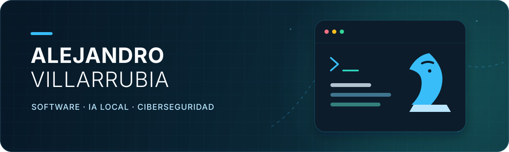

<picture>
  <source
    media="(prefers-color-scheme: dark)"
    srcset="https://raw.githubusercontent.com/villarrubi/villarrubi/output/github-contribution-grid-snake-dark.svg"
  >
  <source
    media="(prefers-color-scheme: light)"
    srcset="https://raw.githubusercontent.com/villarrubi/villarrubi/output/github-contribution-grid-snake.svg"
  >
  
</picture>

  

  <strong>I build useful software for real-world problems:</strong> 
  from engines and desktop applications to local assistants and security tools.

  
  

## Hi, I'm Alejandro

I am a **Computer Engineer** currently working as a **Product Support Engineer at MAHLE**. I enjoy understanding systems end to end: investigating a problem, designing a solution, writing the code and delivering something that people can actually use.

- I work mainly with **Python and C++**, alongside Java, C# and web technologies.
- I explore **local AI**, automation and cybersecurity through working projects.
- I have experience with **LiDAR sensors**, point clouds and real-time client-server systems.
- Away from the keyboard, I am also a **chess club secretary, arbiter and coach**.

## What I'm building

<table>
  <tr>
    <td width="50%" valign="top">
      <h3><a href="https://github.com/villarrubi/ChessBot">♟️ ChessBot</a></h3>
      
A C++20 chess engine with a Windows application, game analysis, UCI support and NNUE evaluation experiments. It can use a local AI model to explain the engine's calculations.

      
<code>C++20</code> <code>Python</code> <code>C#</code> <code>CMake</code> <code>Ollama</code>

    </td>
    <td width="50%" valign="top">
      <h3><a href="https://github.com/villarrubi/Pipa-Personal-Assistant">🎙️ Pipα</a></h3>
      
A local-first personal assistant for Windows with confirmable commands, a control panel and optional integrations. It connects software, voice and an ESP32-S3 physical interface.

      
<code>Python</code> <code>Swift</code> <code>C++</code> <code>ESP32-S3</code> <code>Ed25519</code>

    </td>
  </tr>
  <tr>
    <td width="50%" valign="top">
      <h3><a href="https://github.com/villarrubi/TFG">🛡️ Phishing detector</a></h3>
      
A client-server application that analyses email in Spanish and English using explainable rules and TF-IDF + MLP models. It includes a web interface, Gmail extension and optional monitor.

      
<code>Python</code> <code>Streamlit</code> <code>MLP</code> <code>Gmail API</code> <code>Playwright</code>

    </td>
    <td width="50%" valign="top">
      <h3><a href="https://github.com/villarrubi/TFM_Juan">🏛️ AQUILAE</a></h3>
      
A Roman Empire-themed Risk simulator built as the technical foundation for a master's thesis at the University of Valladolid. It features an interactive vector map with 28 provinces.

      
<code>Java 17</code> <code>Swing</code> <code>Java2D</code> <code>Maven</code>

    </td>
  </tr>
</table>

## Toolbox

| Area | Technologies |
| --- | --- |
| **Languages** | Python · C++ · Java · C# · C · JavaScript · SQL |
| **AI and data** | scikit-learn · Ollama · TF-IDF · MLP · MongoDB · point-cloud processing |
| **Applications and systems** | Windows · Linux · Streamlit · WinForms · Swing · REST APIs · TCP/IP |
| **Engineering** | Git · GitHub Actions · CMake · Maven · Docker · automated testing |

## Beyond the code

Chess is a recurring theme in both my projects and my life. I am involved in the community as an arbiter, coach and club secretary. It has taught me to analyse carefully, make decisions with incomplete information and explain complex ideas clearly.

---

  <strong>Have a project, a technical challenge or a good game to share?</strong>  
  

